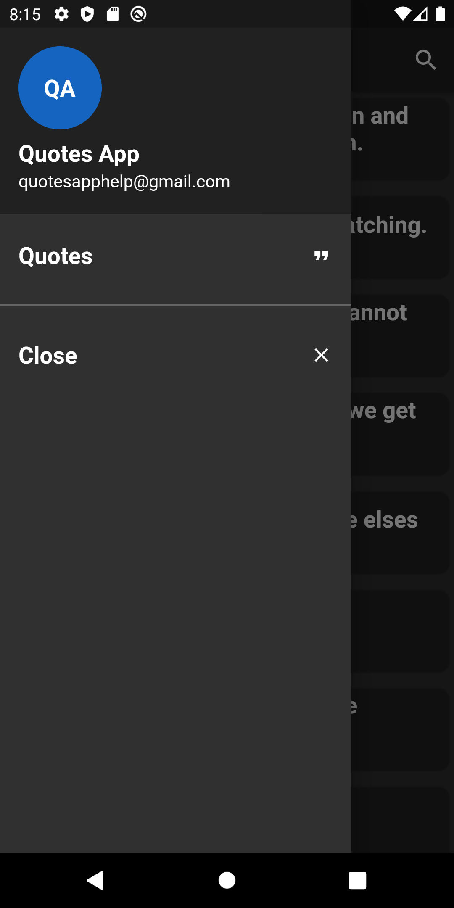
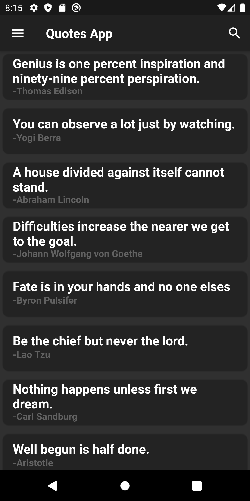
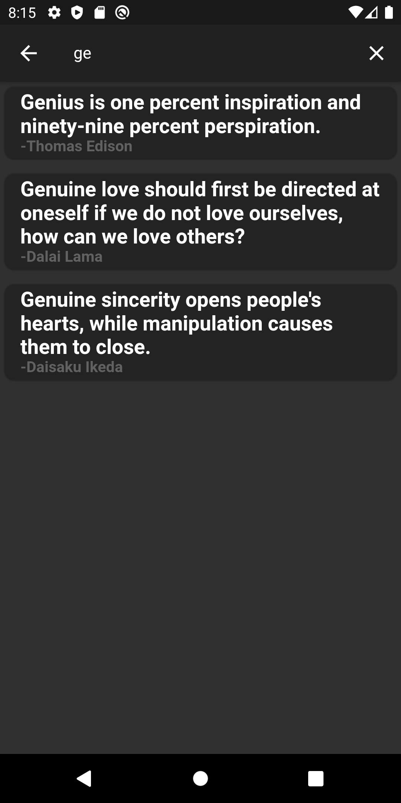

## Quotes App

A Quotes App Which is made using Dart and Flutter.
The APIs Used Can Be Found [Here](https://type.fit/api/quotes)

## Packages Used 

The Following Dart And Flutter Packages Has Been Used In The Project.
```dart
import 'dart:convert';
import 'package:http/http.dart' as http;
```

## Features

- Best Quotes To Start Your Day 👨‍💻
- Search According To Your Mood 🔍
- The Quotes Update Every Day ⚡ 
- Get Inspired By Some Of The Greatest Personalities 👨‍🎓

## GitHub 

If You Want To Create A New Repository In Your GitHub Then Do Following Steps :
1) Open Git Bash.
2) Run The Following Commands :
```git
#Initialize the local directory as a Git repository using :
$ git init

#Add the files in your new local repository. This stages them for the first commit. Use The Following Command :
$ git add .

#Commit the files that you've staged in your local repository.
$ git commit -m "First commit"

#In the Command prompt, add the URL for the remote repository where your local repository will be pushed.
$ git remote add origin remote repository URL
# Sets the new remote
$ git remote -v
# Verifies the new remote URL

#Push the changes in your local repository to GitHub.
$ git push origin master
```

## GitHub  Clone

If You Want To Clone This Repository Then Do The Following Steps :
1) Open Git Bash.
2) Run The Following Commands :
```git
$ git clone https://github.com/dakshp07/quotes-app.git
```

## Images







## Getting Started

This project is a starting point for a Flutter application.

A few resources to get you started if this is your first Flutter project:

- [Lab: Write your first Flutter app](https://flutter.dev/docs/get-started/codelab)
- [Cookbook: Useful Flutter samples](https://flutter.dev/docs/cookbook)

For help getting started with Flutter, view our
[online documentation](https://flutter.dev/docs), which offers tutorials,
samples, guidance on mobile development, and a full API reference.
